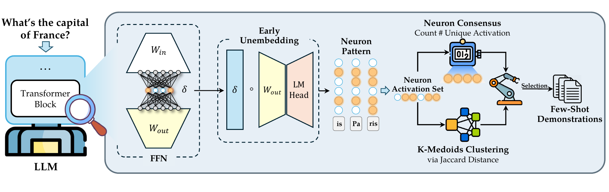
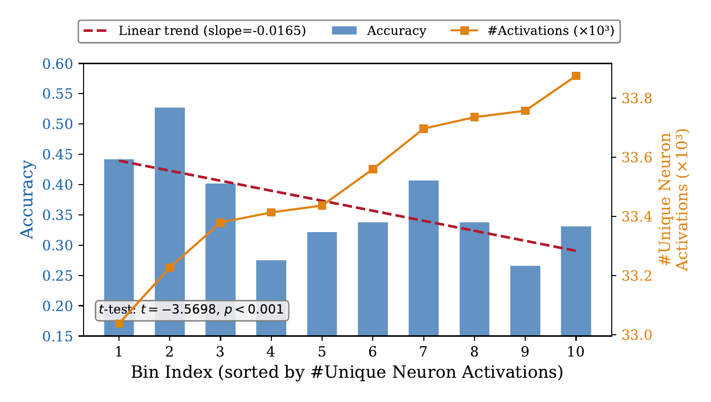

# NEUFS — Neuron-Aware Active Few-Shot Learning

**English** | [中文](README_zh.md)

Minimal open-source implementation of **NEUFS**, the few-shot demonstration
selector described in _Neuron-Aware Active Few-Shot Learning for LLMs_.
Given an unlabeled pool, NEUFS uses the target LLM's internal FFN neuron
activations to pick a small, diverse, hallucination-aware set of examples
for in-context learning.



The pipeline is two self-contained stages:

1. **Activation collection** — run the model over every pool sample, project
   FFN activations through the LM head (early unembedding), and record the
   top-contribution neurons per sample.
2. **Dual-criteria selection** — cluster samples by Jaccard similarity over
   their sparse neuron sets, then pick one sample per cluster using
   `score(x) = tau · Q̃(x) + (1 - tau) · (1 - D̃(x))`, where
   * `Q̃(x)` is the min-max normalized neuron consensus count
     (higher → more unique circuits → more hallucination-prone),
   * `D̃(x)` is the min-max normalized Jaccard distance to the cluster medoid
     (lower → more representative).

**Why does the consensus count Q(x) track hallucination?** Samples that
activate *more* unique neurons are empirically harder for the model to
answer correctly — bins with higher `#Unique Activations` show a clear
downward trend in accuracy (p<0.001). This is consistent with prior
findings that neuron-level agreement / consensus is a mechanistically
grounded signal of whether an LLM is on a reliable inference path
[[Li et al., 2025a]](https://arxiv.org/abs/2504.07440),
[[Li et al., 2025b]](https://arxiv.org/abs/2510.26277).

<p align="center"></p>

## Repo layout

```
NEUFS/
├── neufs/                         core library
│   ├── collate.py                 multiple-choice / candidate collator
│   ├── collect.py                 FFN hooks + early-unembedding top-k
│   ├── features.py                jsonl → (active_mask, score_map, Q(x))
│   ├── kmedoids.py                Jaccard K-Medoids (multi-start, GPU)
│   └── select.py                  dual-criteria per-cluster selection
├── scripts/
│   ├── 01_collect_activations.py  CLI for stage 1
│   ├── 02_select_fewshot.py       CLI for stage 2
│   └── run_example.sh             full example on the toy pool
└── examples/essay_comments/       tiny demo pool + system prompt
```

## Install

```bash
pip install -r requirements.txt
```

Requires a GPU with enough memory to run the target model in bf16/fp16.

## Quickstart

Input pool format — a JSON or JSONL list of records, one per candidate sample:

```json
{"id": 0, "input": "Try to vary your sentence length...", "label": "With Explanation"}
```

Only `input` is strictly required. `label` is carried through to the output
JSON (useful when NEUFS is the selector that _drives_ annotation).

### Stage 1 — collect neuron activations

```bash
python scripts/01_collect_activations.py \
    --model_name Qwen/Qwen3-4B-Instruct-2507 \
    --pool_path examples/essay_comments/pool.jsonl \
    --system_prompt_file examples/essay_comments/system_prompt.txt \
    --prompt_template '<text>{}</text> Is this text contains the explanation relation?' \
    --candidates "Without Explanation" "With Explanation" \
    --output_path cache/essay_comments_qwen3-4b.jsonl \
    --batch_size 4 \
    --top_k_per_layer 2000
```

Output: one JSON line per input sample, with fields
`messages`, `top_neurons`, `entropy`, `pred`, `label`.

### Stage 2 — select few-shot

```bash
python scripts/02_select_fewshot.py \
    --model_name Qwen/Qwen3-4B-Instruct-2507 \
    --neuron_jsonl cache/essay_comments_qwen3-4b.jsonl \
    --pool_path examples/essay_comments/pool.jsonl \
    --output_path outputs/essay_comments/neufs_5shot.json \
    --n_shots 5 \
    --tau 0.5 \
    --topk_per_sample 5000 \
    --n_init 10 \
    --verbose
```

Output: a JSON array with exactly `n_shots` records drawn from the pool,
in the order they were chosen. Plug these straight into your few-shot
prompt template.

### End-to-end demo

```bash
bash scripts/run_example.sh
```


## Programmatic API

```python
from neufs.features import load_neuron_jsonl, build_features
from neufs.select import neufs_select

records = load_neuron_jsonl("cache/essay_comments_qwen3-4b.jsonl")
_, _, consensus, feats = build_features(
    records, num_layers=36, hidden_size=12288, topk_per_sample=5000,
)
indices = neufs_select(feats, consensus, n_shots=10, tau=0.5)
```

## Notes & caveats

* The FFN hook path (`model.model.layers[n].mlp.act_fn`) assumes a LLaMA-style
  architecture (LLaMA-3, Qwen-3, Mistral, etc.). Non-standard models may need
  a different hook target.
* `hidden_size` for features is `config.intermediate_size` (the FFN neuron
  count), **not** `config.hidden_size`.
* Activation collection holds one layer's `act_fn` output for the whole
  batch in memory; tune `--batch_size` down for long prompts or big models.

## Acknowledgement

The neuron-activation collection in [`neufs/collect.py`](neufs/collect.py)
is a direct port of the `get_neuron` routine in **MUI-Eval**:
[ALEX-nlp/MUI-Eval – neuron_and_sae/get_performance/get_neuron.py](https://github.com/ALEX-nlp/MUI-Eval/blob/main/neuron_and_sae/get_performance/get_neuron.py).
The FFN hook target, the contribution-score formula
(`activate_scores * token_projections`), and the per-layer
`top_k = min(top_k_per_layer, num_positions * hidden_size)` flatten-then-topk
convention all follow MUI-Eval. Please cite that paper as well if you use
this code.

## Citation

If you find this code useful, please cite the paper.
