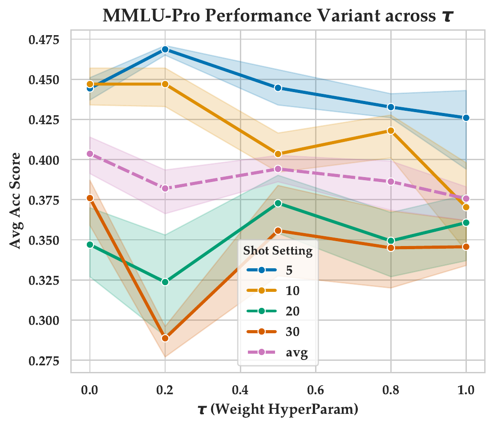
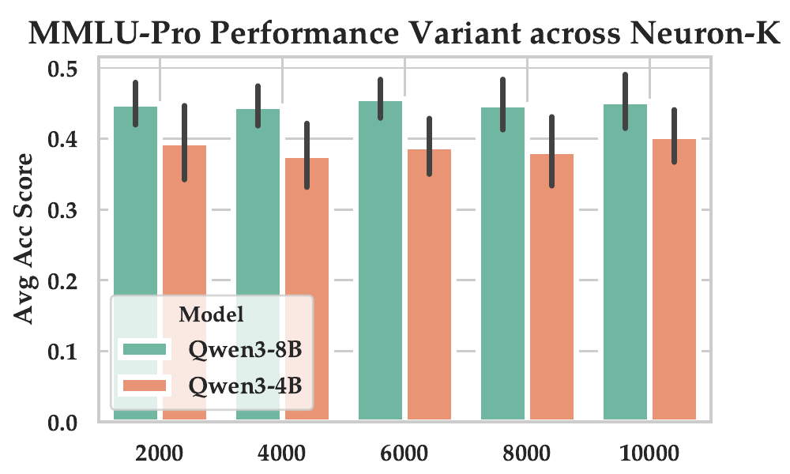

# NEUFS — 基于神经元激活的主动 Few-Shot 选样

[English](README.md) | **中文**

**NEUFS** 的最小开源实现,对应论文 _Neuron-Aware Active Few-Shot Learning for LLMs_。
给定一个无标注候选池,NEUFS 利用目标 LLM 内部的 FFN 神经元激活,挑选
出一组小而多样、且对幻觉敏感的 few-shot 示例,用于 in-context learning。


整条流程分为两个自包含的阶段:

1. **激活采集** — 让模型跑一遍候选池的每个样本,把 FFN 激活通过 LM head
   做早期 unembedding,记录每个样本贡献最大的若干神经元。
2. **双准则选样** — 以稀疏神经元集合之间的 Jaccard 相似度做聚类,然后
   在每个簇内按下式挑一个代表:
   `score(x) = tau · Q̃(x) + (1 - tau) · (1 - D̃(x))`,其中
   * `Q̃(x)` 是簇内按 min-max 归一化的神经元"共识计数"
     (越高 → 独特电路越多 → 越容易产生幻觉),
   * `D̃(x)` 是簇内到 medoid 的 Jaccard 距离(min-max 归一化),
     (越小 → 越能代表整簇)。

**为什么 Q(x) 能追踪幻觉?** 激活"独特神经元"越多的样本,经验上越
容易被模型答错——按 `#Unique Activations` 分箱后,准确率随之单调下降
(p<0.001):

<p align="center"></p>

## 目录结构

```
NEUFS/
├── neufs/                         核心库
│   ├── collate.py                 多选 / 候选项 collator
│   ├── collect.py                 FFN hook + early-unembedding top-k
│   ├── features.py                jsonl → (active_mask, score_map, Q(x))
│   ├── kmedoids.py                Jaccard K-Medoids(多起点,GPU 版)
│   └── select.py                  双准则逐簇选样
├── scripts/
│   ├── 01_collect_activations.py  Stage 1 CLI
│   ├── 02_select_fewshot.py       Stage 2 CLI
│   └── run_example.sh             essay_comments 端到端示例
└── examples/essay_comments/       示例候选池 + system prompt
```

## 安装

```bash
pip install -r requirements.txt
```

需要一块 GPU,显存足够在 bf16/fp16 下跑目标模型。

## 快速上手

候选池格式 —— 一个 JSON 或 JSONL 列表,每条记录一个候选样本:

```json
{"id": 0, "input": "Try to vary your sentence length...", "label": "With Explanation"}
```

严格只需要 `input`。`label` 会原样透传到输出 JSON
(当 NEUFS 作为"驱动标注"的选样器时有用)。

### Stage 1 —— 采集神经元激活

```bash
python scripts/01_collect_activations.py \
    --model_name Qwen/Qwen3-4B-Instruct-2507 \
    --pool_path examples/essay_comments/pool.jsonl \
    --system_prompt_file examples/essay_comments/system_prompt.txt \
    --prompt_template '<text>{}</text> Is this text contains the explanation relation?' \
    --candidates "Without Explanation" "With Explanation" \
    --output_path cache/essay_comments_qwen3-4b.jsonl \
    --batch_size 4 \
    --top_k_per_layer 2000
```

输出:每行一个样本的 JSON,字段为
`messages`, `top_neurons`, `entropy`, `pred`, `label`。

### Stage 2 —— 选 few-shot

```bash
python scripts/02_select_fewshot.py \
    --model_name Qwen/Qwen3-4B-Instruct-2507 \
    --neuron_jsonl cache/essay_comments_qwen3-4b.jsonl \
    --pool_path examples/essay_comments/pool.jsonl \
    --output_path outputs/essay_comments/neufs_5shot.json \
    --n_shots 5 \
    --tau 0.5 \
    --topk_per_sample 5000 \
    --n_init 10 \
    --verbose
```

输出:一个 JSON 数组,恰好 `n_shots` 条记录,顺序即选中顺序。直接塞进
你的 few-shot prompt 模板即可。

### 端到端示例

```bash
bash scripts/run_example.sh
```

## 关键超参

| 名称 | 常用值 | 作用 |
| --- | --- | --- |
| `--top_k_per_layer` | 2000 | Stage 1 内每层的贡献度上限。论文用 2000。 |
| `--topk_per_sample` | 2000–10000 | 聚类前做的全局 top-K 贡献度过滤。越大神经元签名越稠密。对应论文 Fig. 3 的 ablation。 |
| `--tau` | 0.0–1.0 | 0 ≈ 纯多样性(靠近簇中心),1 ≈ 纯共识。论文里 8B 模型常用 0.5,4B 多用 0。见 Table 6。 |
| `--n_init` | 10 | K-Medoids 多起点次数,想更快就调小。 |

论文 Table 6 给了各个模型的最佳超参。

### 论文里的 ablation

`tau` 在 MMLU-Pro (Qwen3-4B) 上的扫描。这个模型上更偏向"多样性"
(`tau` 更小)效果更好;4B 常常在 `tau ≈ 0` 处最好,8B 则在
`tau ≈ 0.5` 附近。

<p align="center"></p>

`topk_per_sample`(神经元签名的稠密程度)在 2k–10k 范围基本平坦——
只要签名够稠密,最终选样对 `K` 的选择并不敏感:

<p align="center"></p>

## 程序化 API

```python
from neufs.features import load_neuron_jsonl, build_features
from neufs.select import neufs_select

records = load_neuron_jsonl("cache/essay_comments_qwen3-4b.jsonl")
_, _, consensus, feats = build_features(
    records, num_layers=36, hidden_size=12288, topk_per_sample=5000,
)
indices = neufs_select(feats, consensus, n_shots=10, tau=0.5)
```

## 注意事项

* FFN hook 的路径(`model.model.layers[n].mlp.act_fn`)假设模型是
  LLaMA 风格的架构(LLaMA-3, Qwen-3, Mistral 等)。非标准模型可能需要
  换一个 hook 目标。
* features 里的 `hidden_size` 指的是 `config.intermediate_size`
  (FFN 神经元数),**不是** `config.hidden_size`。
* 激活采集时,整批会把一层的 `act_fn` 输出留在显存里;遇到长 prompt
  或大模型时,把 `--batch_size` 调小。

## 致谢

[`neufs/collect.py`](neufs/collect.py) 里的神经元激活采集部分直接移植自
**MUI-Eval** 的 `get_neuron`:
[ALEX-nlp/MUI-Eval – neuron_and_sae/get_performance/get_neuron.py](https://github.com/ALEX-nlp/MUI-Eval/blob/main/neuron_and_sae/get_performance/get_neuron.py)。
FFN hook 位置、贡献度公式 (`activate_scores * token_projections`)、
以及每层 `top_k = min(top_k_per_layer, num_positions * hidden_size)`
的 flatten-then-topk 规则都沿用 MUI-Eval。如果使用本代码,请一并引用
它的论文。

## 引用

如果这份代码对你有帮助,请引用论文。
